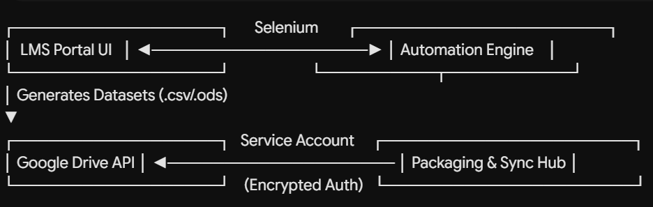

# 🎓 LMS Academic Data Extraction & Cloud Synchronization Suite

[](https://github.com/SalaiJiChanWook/lms-dataset-automation-suite/releases)
[](https://www.python.org/)
[](https://ttkbootstrap.readthedocs.io/)
[](https://www.selenium.dev/)
[](https://developers.google.com/drive)

An enterprise-grade desktop automation utility engineered to streamline academic record extraction, batch compression, and automated cloud synchronization for distributed institutional learning portals.

---

## 📌 Executive Summary

Manual export and archiving of multi-subject academic records across distributed Learning Management Systems (LMS) introduce administrative friction and data loss risks. 

This utility provides an end-to-end automation pipeline:
1. **Dynamic Web Scraping:** Programmatically authenticates and traverses complex grade books and curriculum modules.
2. **Local Packaging:** Compresses raw datasets into standardized, timestamped archive packages.
3. **Cloud Dispatch:** Authenticates via non-expiring Google Cloud Service Accounts to deliver batch records directly to designated Google Drive enterprise storage.

---

## ⚙️ Architecture & Core Components


## - **User Interface:** Modern desktop GUI engineered with `ttkbootstrap` running multithreaded workers to prevent UI freezes during long batch operations.
- **Resilient Automation:** Refactored crawler using explicit waits (`WebDriverWait`) and dynamic DOM traversals adhering to the **DRY (Don't Repeat Yourself)** software pattern.
- **Enterprise Cloud Security:** Completely detached from fragile interactive OAuth flows by utilizing server-to-server **Google Service Accounts**, ensuring scheduled zero-maintenance operations.

---

## 🚀 Key Features

- **Multi-Select Curriculum Extraction:** Selective or batch extraction across 11 core academic subject modules.
- **Non-Expiring Cloud Sync:** Integrated Service Account engine eliminates token expiration issues (`invalid_grant`).
- **Disk Space Preservation:** Built-in clean-up subsystem with automated purge workflows for temporary `.ods` and `.csv` files.
- **Live Output Stream:** Embedded asynchronous logging console reflecting real-time pipeline status and system telemetry.

---

## 🛠️ Installation & Local Setup

### Prerequisites
- Python 3.10+
- Google Chrome browser installed
- A Google Cloud Service Account with Google Drive API enabled

### Steps

1. **Clone the repository:**
   ```bash
   git clone [https://github.com/SalaiJiChanWook/lms-dataset-automation-suite.git](https://github.com/SalaiJiChanWook/lms-dataset-automation-suite.git)
   cd lms-data-collector
   - **User Interface:** Modern desktop GUI engineered with `ttkbootstrap` running multithreaded workers to prevent UI freezes during long batch operations.
- **Resilient Automation:** Refactored crawler using explicit waits (`WebDriverWait`) and dynamic DOM traversals adhering to the **DRY (Don't Repeat Yourself)** software pattern.
- **Enterprise Cloud Security:** Completely detached from fragile interactive OAuth flows by utilizing server-to-server **Google Service Accounts**, ensuring scheduled zero-maintenance operations.

---

## Establish a virtual environment:
>>   python -m venv venv 
>> source venv/bin/activate  # On Windows: venv\Scripts\activate 

## Install dependencies:
>> pip install -r requirements.txt 

